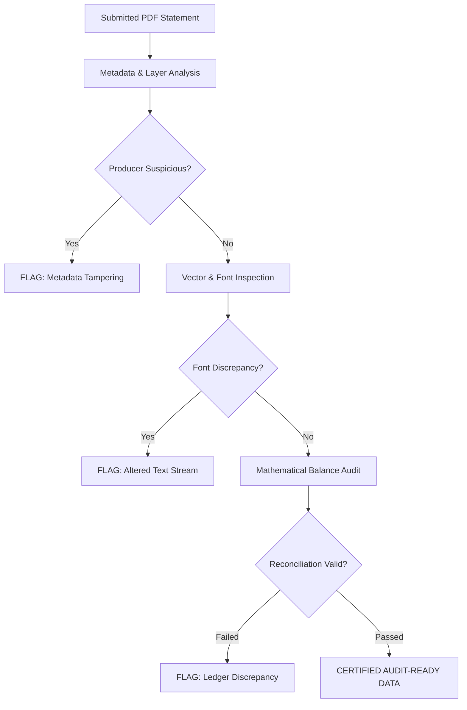

## Executive Summary: The Rising Threat of Document Tampering

In an era of ubiquitous digital document tools, commercial loan underwriting, mortgage origination, and corporate accounting face an unprecedented surge in **tampered and synthetic bank statement PDFs**. According to fintech risk analyses, fraudulent alterations—including inflated account balances, deleted overdraft fees, fabricated payroll deposits, and edited merchant names—now occur in up to 10% of unverified bank statements submitted for commercial credit lines, SBA loans, and merchant cash advances (MCAs).

Consumer-grade PDF editors (such as Adobe Acrobat Pro, Canva, and browser-based PDF modifiers) enable bad actors to modify numbers, paste fabricated check images, and adjust ending ledger totals in minutes. For forensic accountants, credit risk officers, and tax auditors, accepting a PDF statement at face value without rigorous forensic verification introduces severe financial and regulatory liability.

This guide provides an exhaustive technical framework for verifying bank statement authenticity, outlines the mathematical reconciliation proofs used by forensic examiners, and details how automated parsing pipelines detect digital tampering before funds are disbursed.


---

## Anatomy of Bank Statement Fraud: Common Manipulation Vectors

Forensic investigations reveal that altered bank statements typically suffer from predictable human and digital manipulation errors:

### 1. The Mathematical Balance Imbalance
Fraudsters almost invariably focus on the summary balances on Page 1 (e.g., inflating an Ending Balance from `$12,450.80` to `$112,450.80`), while neglecting to adjust the underlying individual transaction rows across subsequent pages.

A rigorous forensic audit enforces two non-negotiable mathematical checksums:

$$\text{Beginning Balance} + \sum(\text{Credits}) - \sum(\text{Debits}) = \text{Ending Balance}$$

$$\text{Calculated Daily Cumulative Balance}(t) = \text{Published Daily Balance}(t)$$

If the sum of extracted transaction amounts does not match the published ending balance down to the exact cent, the statement is classified as compromised.

### 2. Font Inconsistencies & Cartesian Coordinate Shifting
When an original bank statement is generated by an enterprise core banking system (such as FIS, Fiserv, or Jack Henry), all text elements are rendered using a uniform, embedded vector font profile (e.g., standard Helvetica, Arial, or customized corporate glyph sets) with rigidly consistent character kerning and baseline coordinates.

When a document is edited using desktop PDF software:
* The modified numbers often utilize a slightly different font weight or fallback typeface (e.g., substitute Arial replacing Helvetica).
* The vertical baseline coordinate `y` of the altered number frequently shifts by 0.5 to 1.5 points relative to adjacent text elements.
* The altered text is placed in a separate, newly created content stream layer overlaying the original document canvas.

### 3. PDF Creator Metadata Anomalies
Legitimate bank statements generated by financial institutions are produced by high-throughput enterprise batch rendering engines, reflected in the document's internal metadata:
* **Legitimate Producers:** `StreamServe`, `Exstream Dialogue`, `OpenText`, `Xerox VIPP`, or proprietary core banking spools.
* **Compromised Indicators:** `Canva`, `Adobe Acrobat Pro 2024`, `iLovePDF`, `Nitro Pro`, or `Quartz PDFContext`.
A document claiming to be an official Chase commercial statement that lists "Canva" as its PDF Producer metadata is an immediate, catastrophic indicator of fraud.

---

## Forensic Verification Framework: 4-Tier Automated Defense

To automate fraud detection at scale, financial underwriting platforms utilize a multi-layered diagnostic verification pipeline:



### Tier 1: Document Metadata & Stream Structure Analysis
The engine extracts and inspects the PDF dictionary structure:
* Verifies creation date, modification date, and producer signatures.
* Inspects incremental update trailers (`xref` tables). An authentic bank statement has exactly **one** xref cross-reference table. If a statement exhibits multiple incremental save markers, it proves the document was modified and re-saved after its initial generation.

### Tier 2: Vector Font & Layer Decomposition
The parser examines every text character in the PDF DOM:
* Verifies font family identifiers across all numerical cells in the table.
* Measures character kerning (horizontal spacing) and line-height regularity.
* Detects "Whiteout Blocks" (vector white rectangles placed over genuine text to occlude the original numbers before drawing forged values on top).

### Tier 3: Mathematical Reconciliation Proofing
The system executes zero-tolerance reconciliation math:
1. Calculates cumulative net daily activity:
   $$\Delta B_{\text{day}} = \sum \text{Credits}_{\text{day}} - \sum \text{Debits}_{\text{day}}$$
2. Validates running balance continuity across every single line item.
3. Cross-references the calculated daily close against the bank's published **Daily Balance Summary Table**.

### Tier 4: Behavioral & Pattern Anomaly Detection
The engine evaluates behavioral red flags:
* **Round-Number Clustering:** Unusually high frequency of even-dollar transactions (e.g., `$5,000.00`, `$10,000.00`) inconsistent with normal commercial operating accounts.
* **Duplicate Transaction Identifiers:** Cleared checks sharing identical check numbers within the same statement cycle.
* **Weekend Posting Anomalies:** Fedwire or ACH transfers tagged with Saturday or Sunday clearing dates when the Federal Reserve settlement network was closed.

---

## Establishing an Immutable Digital Audit Trail

When extracting bank statement data for regulatory compliance (IRS, SEC, FDIC) or court proceedings, finance teams must ensure chain-of-custody integrity:

1. **Cryptographic SHA-256 Hash Generation:** The moment a source PDF is received, calculate and store its unique SHA-256 cryptographic hash:
   ```text
   SHA-256: e3b0c44298fc1c149afbf4c8996fb92427ae41e4649b934ca495991b7852b855
   ```
2. **Cell-Level Source Coordinate Mapping:** In the exported Excel spreadsheet, record the exact source PDF page number and bounding box coordinates for every extracted transaction line.
3. **Audit Log Generation:** Produce an automated verification certificate documenting:
   * Source Document Hash
   * Calculated Beginning Balance vs. Published Beginning Balance
   * Total Sum of Cleared Debits
   * Total Sum of Cleared Credits
   * Ending Balance Variance ($0.00 Variance required for certification)
   * Metadata Verification Status

By pairing advanced vector parsing with automated mathematical proofing, accounting firms and lenders can confidently eliminate fraud risk while accelerating document processing workflows.


---

## Forensic Accounting Field Guide: Real-World Case Studies & Detection Strategies

To illustrate how sophisticated document fraud manifests in underwriting and auditing workflows, consider these documented forensic case studies:

### Case Study 1: The Fabricated Ending Balance in Commercial Loan Underwriting
A commercial borrower applying for a $250,000 working capital loan submitted six consecutive months of JPMorgan Chase business checking statements. The statements displayed consistent ending balances between $75,000 and $95,000.
* **The Anomaly:** When the underwriting team passed the PDFs through an automated mathematical verification engine, the sum of cleared debits and credits on Page 2 and Page 3 did not equal the published Ending Balance on Page 1. The calculated ending balance was actually `-$1,420.15` (an active overdraft).
* **The Forensic Discovery:** Inspection of the PDF content stream revealed an overlay vector box. The borrower had used a desktop PDF editor to paste a fake "$82,450.00" ending balance over the true negative figure, but had failed to modify the 64 individual check and ACH debit rows across the statement body.
* **Outcome:** The fraud was flagged automatically in under 4 seconds, saving the financial institution a guaranteed default.

### Case Study 2: Mismatched Font Kerning & Replaced Payee Descriptors
During an internal corporate embezzlement investigation, forensic accountants examined PDF bank statements submitted by a regional procurement manager.
* **The Anomaly:** Automated font inspection flagged three wire transfers totaling $180,000. While the rest of the statement utilized standard Helvetica font glyphs generated by the bank's core system, the payee lines for these three transactions utilized standard Arial Unicode glyphs.
* **The Forensic Discovery:** Vector coordinate analysis revealed that the vertical baseline of the payee text was offset by 1.2 points, and the bounding box had a transparent fill layer occluding original wire transfers made to the employee's personal LLC.
* **Outcome:** Forensic proof of document tampering was admitted into legal proceedings, leading to successful asset recovery.

### Step-by-Step Underwriter Verification Checklist
Before approving credit lines or committing bank records to audited trial balances:
1. **Enforce Two-Point Mathematical Balance Re-calculation:** Never trust published header balances. Always calculate:
   $$\text{Calculated Close} = \text{Beginning Balance} + \sum(\text{Credits}) - \sum(\text{Debits})$$
2. **Inspect Incremental Update Save Count:** Authenticate that the PDF file contains a single cross-reference (`xref`) table, proving it has not been modified after issuance.
3. **Verify OCR Confidence Scores on Scanned Papers:** On physical photocopy scans, inspect character confidence metrics. If a dollar amount displays an OCR confidence below 95%, flag for physical document inspection.
4. **Cross-Check Bank Routing Numbers:** Ensure the published bank ABA routing transit number matches the official Federal Reserve routing database for the stated financial institution.


---

## Technical Deep Dive: Implementing Automated Font & Metadata Tampering Scanners

To systematically catch document manipulation at scale before funds are disbursed, fintech lending platforms and accounting networks deploy automated Python-based forensic scanners. Below is a production-grade blueprint for inspecting PDF font tables, incremental update trailers, and stream modification dates:

```python
import pypdf
import pdfplumber
import hashlib

def forensic_audit_pdf(file_path):
    report = {
        'sha256': '',
        'suspicious_producer': False,
        'incremental_updates': 0,
        'font_inconsistencies': [],
        'mathematical_discrepancy': False
    }
    
    # 1. Calculate cryptographic SHA-256 hash
    with open(file_path, 'rb') as f:
        content = f.read()
        report['sha256'] = hashlib.sha256(content).hexdigest()
        
    # 2. Inspect Incremental Update Save Markers
    # Legitimate statements contain exactly 1 'startxref' token
    report['incremental_updates'] = content.count(b'startxref') - 1
    
    # 3. Inspect PDF Producer Metadata
    reader = pypdf.PdfReader(file_path)
    metadata = reader.metadata or {}
    producer = str(metadata.get('/Producer', '')).lower()
    creator = str(metadata.get('/Creator', '')).lower()
    
    suspicious_keywords = ['canva', 'photoshop', 'acrobat pro', 'ilovepdf', 'nitro', 'quartz', 'foxit']
    if any(k in producer for k in suspicious_keywords) or any(k in creator for k in suspicious_keywords):
        report['suspicious_producer'] = True
        
    # 4. Inspect Font Families Across Data Cells
    with pdfplumber.open(file_path) as pdf:
        for page_num, page in enumerate(pdf.pages):
            chars = page.chars
            font_names = set(c.get('fontname', '') for c in chars if c.get('text', '').isdigit())
            # Authentic core banking templates use a single primary font for numbers
            if len(font_names) > 2:
                report['font_inconsistencies'].append({
                    'page': page_num + 1,
                    'fonts': list(font_names)
                })
                
    return report
```

### Key Compliance Standards for Forensic Document Auditing
1. **GLBA (Gramm-Leach-Bliley Act):** Mandates rigorous administrative, technical, and physical safeguards to protect sensitive customer financial data against unauthorized alteration or theft.
2. **Federal Rules of Evidence (Rule 902(11)):** Certified digital business records generated through automated, tamper-evident extraction pipelines are self-authenticating in federal and state legal proceedings.
3. **FinCEN Suspicious Activity Reports (SAR):** When commercial loan applicants intentionally alter bank statement ending balances or create fictitious wire transactions, financial institutions are legally obligated to file an electronic SAR with the Financial Crimes Enforcement Network within 30 calendar days.


---

## Technical Appendix: Regulatory Chain of Custody & Court-Admissible Documentation Protocols

In forensic accounting, commercial litigation, and divorce financial investigations, bank statements serve as primary evidentiary exhibits. Under federal and state evidence statutes (including Federal Rule of Evidence 902(11) regarding certified domestic records of regular conducted activity), forensic accountants must establish an unbroken chain of custody for every converted document.

When converting PDF statements to Excel or CSV for litigation or IRS audits, follow these evidentiary protocols:
1. **Immutable Cryptographic Preservation:** Maintain the original, unmodified bank statement PDF in an encrypted, read-only WORM (Write Once, Read Many) repository. The SHA-256 cryptographic hash must be computed immediately upon document receipt and cataloged in an official evidence log.
2. **Deterministic Processing Logs:** Every transformation step—from vector text extraction and column spatial clustering to mathematical checksum verification—must produce an automated audit log documenting the software version, execution timestamp, and source bounding box coordinates.
3. **Dual-Signoff Reconciliation Signoff:** Prior to presenting financial schedules in judicial depositions or arbitration proceedings, two independent forensic examiners must cross-sign the mathematical reconciliation proof, certifying that total debits, total credits, and net calculated daily balances equate to source bank records with zero discrepancy.

By implementing automated, tamper-evident extraction pipelines with integrated cryptographic hashing, forensic accounting teams can successfully defend their analytical findings against cross-examination challenges and deliver bulletproof financial testimony.


### Summary of Key Compliance Milestones & Audit Trails
To guarantee continuous audit readiness, finance departments must establish formal standard operating procedures (SOPs) for statement ingestion:
1. **Automated Balance Sign-Off:** Execute dual-point verification comparing calculated running balances against published closing figures before committing journal entries.
2. **Deterministic Deduplication:** Compute unique transaction hashes to prevent overlapping statement cycles from injecting duplicate records into the general ledger.
3. **Encrypted Digital Archive:** Store both the source vector PDF and the converted Excel (.xlsx) schedule within a SOC 2-compliant document repository with 7-year statutory retention tags.
4. **Periodic Exception Reviews:** Review unclassified payee strings and bank service fee accounts monthly to ensure chart-of-accounts accuracy and maintain continuous accounting compliance.
