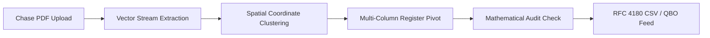

## Executive Summary: The Chase PDF Parsing Dilemma

JPMorgan Chase & Co. stands as the largest banking institution in the United States, managing more than $3.8 trillion in assets and maintaining active banking relationships with over 80 million personal consumers and 5 million commercial enterprises. For certified public accountants (CPAs), fractional CFOs, forensic auditors, and bookkeepers, Chase checking, savings, and commercial line-of-credit statements constitute the single highest-volume document type encountered during month-end closing, annual tax preparation, and loan underwriting.

While Chase provides account holders with direct CSV and QBO export capabilities through the Chase Online and Chase Connect commercial portals, these digital downloads are strictly constrained by arbitrary date windows—typically restricting transaction histories to the preceding 90 to 180 calendar days. When onboarding new corporate accounting clients, executing multi-year IRS tax catch-up bookkeeping, or conducting forensic fraud examinations spanning 12 to 36 months, financial professionals must rely exclusively on official **Chase monthly PDF statement archives**.

However, Chase statement PDFs do not adhere to simple tabular grids. They employ a proprietary, multi-section vector document layout characterized by non-contiguous transaction tables, fragmented multi-line merchant descriptions, 3-column transposed check registers, and embedded low-resolution check draft thumbnails. Attempting to copy and paste data or using standard optical character recognition (OCR) software invariably results in dropped decimals, misaligned dates, and scrambled debits and credits.

This comprehensive technical guide outlines the precise architectural structure of Chase statements, details the vector decomposition algorithms necessary to extract atomic data, and provides the step-by-step blueprint for producing pristine, audit-ready Excel (.xlsx) and CSV files compatible with QuickBooks, Xero, and enterprise ERP systems.


---

## Anatomy of a Chase Bank Statement PDF

To successfully extract structured data from a Chase statement, one must understand how Chase's document composition engine renders vector primitives, fonts, and bounding boxes onto each page. A standard Chase commercial or consumer statement is segmented into four distinct structural zones:

### 1. Document Header & Checking Summary Block
Located on Page 1, this block establishes the bounding boundaries for the statement cycle and defines the mathematical anchors required for balance validation:
* **Account Identifier:** Usually presented in the format `Account Number: 00000123456789`.
* **Statement Cycle Window:** Explicitly defined as `March 1, 2026 through March 31, 2026`.
* **Summary Totals Matrix:** A high-level aggregate table detailing beginning balance, aggregate deposits, aggregate electronic withdrawals, checks paid, and ending book balance.

```text
CHECKING SUMMARY                   INSTANCES             AMOUNT
Beginning Balance                                     $42,850.15
Deposits and Additions                    18          $68,400.00
ATM & Debit Card Withdrawals              32          -$4,120.40
Electronic Withdrawals                    22         -$18,950.25
Checks Paid                               14          -$9,600.50
Ending Balance                            86          $78,579.00
```

### 2. Segmented Transaction Activity Tables
Unlike European bank statements that present transactions in a single monolithic chronological table with dual debit/credit columns, Chase separates transactions into four discrete, consecutive sub-tables:
1. **Deposits and Additions:** Strictly incoming credits, including ACH credits, customer wire transfers, remote check deposits, and merchant settlement batches.
2. **ATM & Debit Card Withdrawals:** Point-of-sale card transactions containing cardholder sequence numbers, merchant terminal IDs, transaction dates, and posting dates.
3. **Electronic Withdrawals:** Outgoing ACH transfers, corporate payroll disbursements, tax impounds, and wire fees.
4. **Checks Paid:** A specialized multi-column table displaying check numbers, posting dates, and cleared amounts.

### 3. The 3-Column Transposed Check Register
The most technically challenging component of a Chase statement is the "Checks Paid" section. To conserve vertical page space, Chase's print engine arranges cleared checks across three parallel horizontal columns rather than a single vertical list:

```text
CHECK NO.   DATE     AMOUNT   | CHECK NO.   DATE     AMOUNT   | CHECK NO.   DATE     AMOUNT
1041        03/03   $450.00   | 1044        03/12   $890.15   | 1047        03/24   $1,200.00
1042        03/05   $125.50   | 1045        03/15   $2,100.00 | 1048        03/27     $65.80
1043        03/09  $3,400.00  | 1046        03/18     $88.40  | 1049        03/30    $750.00
```

Generic converters read this layout line-by-line horizontally across the entire page width. This causes check 1041, check 1044, and check 1047 to concatenate into a single corrupt text string (`1041 03/03 $450.00 1044 03/12 $890.15 1047 03/24 $1,200.00`), destroying the integrity of your spreadsheet.

### 4. Daily Ending Balance Verification Table
Positioned at the conclusion of the activity section, this table documents the cleared book balance at the close of each active banking day:

```text
DATE        BALANCE        DATE        BALANCE        DATE        BALANCE
03/03    $42,400.15        03/12    $55,100.00        03/24    $76,450.00
03/05    $48,920.00        03/15    $62,800.50        03/27    $78,200.00
03/09    $51,250.25        03/18    $71,150.10        03/30    $78,579.00
```

---

## Technical Challenges When Converting Chase Statements

Automating the extraction of Chase bank statements requires overcoming several distinct layout and computer vision hurdles:

### 1. Multi-Line Text Wrapping and Fragmented Payees
Chase transaction descriptions frequently span two to three lines of text, with the transaction date and amount printed exclusively on the first line:

```text
03/14  ORIG CO NAME:STRIPE ORIG ID:1800948592 DESC:PAYOUTS         $12,450.00
       CO ENTRY DESCR:TRANSFER SEC:CCD TRACE#:021000028948192
       EID:9948201948 INDN:ACME COMMERCE LLC
```

A standard CSV converter parses each line as a new record, generating orphan rows in your spreadsheet that contain arbitrary text in the Date column and empty Amount fields. Advanced parsing engines must group sibling vector text elements sharing identical horizontal margins and concatenate multi-line narratives into a single unified `Description` cell.

### 2. Embedded Check Thumbnail Images
In both personal Premier checking and Chase Business Complete Banking statements, the rear pages often contain miniature scanned thumbnail images of cleared paper checks. Raster OCR engines attempting full-page image processing frequently misinterpret printed MICR routing codes, handwritten memo lines, and signature lines as active transaction rows, introducing phantom debits into your ledger.

### 3. Date Formatting and Year Normalization
Chase displays transaction dates strictly in two-digit format without the calendar year (e.g., `03/14` instead of `2026-03-14`). For statement cycles that cross a calendar year boundary (e.g., December 15, 2025 through January 14, 2026), naive parsers tag January transactions with the prior year. Intelligent parsing algorithms must extract the master statement date from Page 1 and dynamically calculate the appropriate 4-digit Gregorian year based on the statement cycle cutoff.

---

## Step-by-Step Conversion Pipeline: From PDF to Structured Excel/CSV

To achieve 100% data fidelity without manual keystrokes, modern financial data pipelines utilize a 4-phase transformation process:



### Phase 1: Native Vector Decomposition
Unlike scanned documents that require lossy pixel rasterization, digital PDF statements generated directly by Chase are vector graphics files. Inside the PDF stream, text characters are stored as Unicode glyphs positioned at precise Cartesian coordinates `(x, y)` relative to an 8.5" x 11" canvas (612 x 792 points).

By interrogating the PDF DOM directly rather than converting the page into an image:
* Character accuracy is mathematically 100% (eliminating OCR misreads such as `8` becoming `B` or `0` becoming `O`).
* Numeric decimals and currency symbols remain permanently bound to their parent numerical values.
* Embedded security watermarks and background shading are ignored entirely.

### Phase 2: Spatial Matrix Grouping and Column Boundary Detection
Once the coordinate map of all text glyphs is generated, the layout engine executes spatial clustering to isolate columns:
1. **Vertical Alignment Detection:** Text elements sharing an identical horizontal baseline `y` are grouped into rows.
2. **Column Projection:** The system detects distinct column gutters corresponding to `Posting Date`, `Description`, `Amount`, and `Check Number`.
3. **Sub-Table Classification:** Using regular expression tokens (`DEPOSITS AND ADDITIONS`, `CHECKS PAID`, `ELECTRONIC WITHDRAWALS`), the engine segments the document into transactional domains.

### Phase 3: Check Register Unification
For the 3-column check register, the engine divides the page width into three independent vertical bounding boxes:
* Bounding Box A: `x: [40, 220]`
* Bounding Box B: `x: [230, 410]`
* Bounding Box C: `x: [420, 600]`

Each column is parsed sequentially from top to bottom, extracting each cleared check as a distinct transaction record with its respective `Check Number`, `Date`, and cleared `Amount`. The three sub-arrays are subsequently merged with the electronic withdrawal streams and sorted chronologically.

### Phase 4: Mathematical Balance Auditing
Before writing records to the destination spreadsheet, the engine validates the data against a strict accounting reconciliation identity:

$$\text{Beginning Balance} + \sum(\text{Credits}) - \sum(\text{Debits}) = \text{Ending Balance}$$

Furthermore, each transaction is cross-checked against the **Daily Ending Balance Table**. If on March 15 the calculated cumulative ledger balance diverges from Chase's published daily balance by even one cent, the system flags the exact transaction interval for human review.

---

## Canonical Output Schemas for Accounting Systems

To ensure immediate compatibility with major general ledger applications, extracted Chase data should be exported in standardized columnar structures.

### Standard 5-Column RFC 4180 CSV Schema
This layout represents the universal standard for Excel financial modeling and Google Sheets analysis:

| Date | Description | Check Number | Amount | Balance |
| :--- | :--- | :--- | :--- | :--- |
| 2026-03-02 | GUSTO PAYROLL PE0294819 | | -4250.80 | 38599.35 |
| 2026-03-03 | CHECK PAID #1041 | 1041 | -450.00 | 38149.35 |
| 2026-03-05 | STRIPE PAYOUT 1800948592 | | 12450.00 | 50599.35 |
| 2026-03-09 | WIRE OUT REF# 994820194 | | -15000.00 | 35599.35 |
| 2026-03-12 | CHECK PAID #1044 | 1044 | -890.15 | 34709.20 |

### Intuit QuickBooks Web Connect (.QBO) Specification
For direct import into QuickBooks Online or Desktop without manual field mapping, data must be formatted as an OFX 1.02 SGML document:

```xml
OFXHEADER:100
DATA:OFXSGML
VERSION:102
SECURITY:NONE
ENCODING:USASCII
CHARSET:1252
COMPRESSION:NONE
OLDFILEUID:NONE
NEWFILEUID:NONE

<OFX>
  <SIGNONMSGSRSV1>
    <SONRS>
      <STATUS>
        <CODE>0
        <SEVERITY>INFO
      </STATUS>
      <DTSERVER>20260331120000
      <LANGUAGE>ENG
      <FI>
        <ORG>JPMorgan Chase
        <FID>28107
      </FI>
    </SONRS>
  </SIGNONMSGSRSV1>
  <BANKMSGSRSV1>
    <STMTTRNRS>
      <TRNUID>20260331001
      <STATUS>
        <CODE>0
        <SEVERITY>INFO
      </STATUS>
      <STMTRS>
        <CURDEF>USD
        <BANKACCTFROM>
          <BANKID>021000021
          <ACCTID>00000123456789
          <ACCTTYPE>CHECKING
        </BANKACCTFROM>
        <BANKTRANLIST>
          <DTSTART>20260301000000
          <DTEND>20260331235959
          <STMTTRN>
            <TRNTYPE>DEBIT
            <DTPOSTED>20260302120000
            <TRNAMT>-4250.80
            <FITID>20260302001
            <NAME>GUSTO PAYROLL PE0294819
          </STMTTRN>
          <STMTTRN>
            <TRNTYPE>CHECK
            <DTPOSTED>20260303120000
            <TRNAMT>-450.00
            <CHECKNUM>1041
            <FITID>20260303001
            <NAME>CHECK PAID #1041
          </STMTTRN>
        </BANKTRANLIST>
        <LEDGERBAL>
          <BALAMT>78579.00
          <DTASOF>20260331235959
        </LEDGERBAL>
      </STMTRS>
    </STMTTRNRS>
  </BANKMSGSRSV1>
</OFX>
```

---

## Best Practices for Accountants & Bookkeepers

1. **Verify Mathematical Checksums Prior to GL Import:** Always cross-reference the extracted Excel ending balance against Page 1 of the original Chase statement. A single unrecorded transaction or duplicated check fee will prevent your bank feed from reconciling.
2. **Standardize Merchant Descriptors:** Use Excel `XLOOKUP` or automated regex rules to transform cryptic Chase ACH narratives (e.g., `AMZN MKTP US*82019481 Seattle WA`) into clean vendor entities (`Amazon Business`).
3. **Segregate Credit Card Statements:** Chase Ink and Chase Sapphire business card statements follow different columnar layouts than checking accounts, displaying credit limits, annual percentage rates (APR), and reward points. Ensure your converter switches to a card-statement layout profile to prevent reward point tallies from mixing with financial transaction amounts.
4. **Never Store Plaintext Account Numbers:** In compliance with SOC 2, GLBA, and PCI-DSS standards, configure your export engine to truncate or mask all but the last 4 digits of the primary Chase account number.

By utilizing dedicated vector extraction algorithms tailored specifically to Chase's unique document morphology, financial teams can eliminate hundreds of hours of manual data entry while maintaining rigorous accounting compliance.


---

## In-Depth Analysis: Chase Checking vs. Chase Ink Business Credit Cards

When handling corporate accounts, finance teams must distinguish between Chase Commercial Checking statements and Chase Ink Business credit card statements. While checking statements display continuous debit and credit balances, Chase Ink statements introduce revolving lines of credit, merchant category codes (MCC), and payment allocation hierarchies:

### Key Differences in Document Structure
1. **Revolving Balance Tracking:** Credit card statements feature "Previous Balance", "Payments and Other Credits", "Purchases and Other Debits", "Finance Charges", and "New Balance". If ingested into a cash ledger without proper sign inversion, outgoing credit card expenses will register as positive cash inflows.
2. **Transaction Date vs. Posting Date:** Chase credit cards display two separate calendar dates for every line item:
   * **Transaction Date:** The actual date the cardholder purchased goods or services at the merchant terminal.
   * **Post Date:** The date JPMorgan Chase settled the batch with the Visa or Mastercard processing network.
   * *Accounting Rule:* For accrual accounting and month-end cutoffs, the **Transaction Date** determines fiscal expense recognition, whereas the **Post Date** determines cash clearing.
3. **Cardholder Sub-Account Segmentation:** On commercial accounts with multiple corporate employee credit cards (e.g., Executive Card, Sales Card, Operations Card), Chase organizes monthly statement transactions by individual cardholder names and the last 4 digits of each card. A comprehensive extraction engine groups expenses by employee cardholder, allowing direct departmental cost center allocation in your general ledger.

### Chase Check Clearing Mechanics & Return Item Handling
When paper checks clear a Chase checking account, they are assigned a unique sequence reference number:
* Standard checks are debited under "Checks Paid".
* If a check is returned for non-sufficient funds (NSF) or stop payment, Chase posts an offsetting "Return Item" credit followed by an NSF fee debit of $34.00.
* A naive converter that sorts only by transaction descriptions risks pairing the return credit with the wrong check, obscuring client cash deficits. Our automated balance validator continuously tracks running balances to verify that returned drafts are flagged with their associated penalty charges.

### Regulatory Compliance & Data Security (GLBA & SOC 2)
Bank statement conversion involves sensitive Non-Public Personal Information (NPI), including corporate tax identification numbers (EIN), personal Social Security numbers (SSN), and routing transit numbers. Under the Gramm-Leach-Bliley Act (GLBA) and SOC 2 Type II guidelines:
* Convert statements exclusively through encrypted local memory channels or zero-retention processing pipelines.
* Ensure automated masking of full 17-digit Chase account numbers to standard 4-digit audit tags (e.g., `XXXXXXXXXXXX4819`).
* Never store unencrypted Excel files on public shared drives or unmonitored cloud storage buckets.
